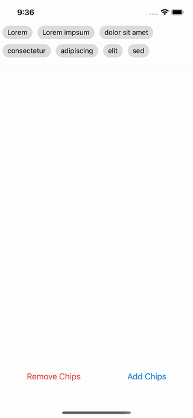
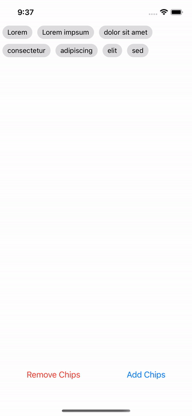
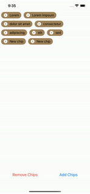

# SwiftChips 🍟

[![MIT License][license-image]][license-url]

A SwiftUI implementation for chips. Chips allow users to view information, make selections, filter content, and enter data.

The library support 3 different modes:

- *Single Selection*: Only 0 or 1 chips can be selected at the same time.
- *Multiple Selection*: 0 or all chips can be selected at the same time.
- *Deletable*: Chips cannot be selected by the user but can be eventually deleted.

## Work modes

### Single Selection work mode

In this mode the user can only select 1 chip at a time, or none.

### Multiple Selection work mode

In this mode the user can only select from 0 to all chips.

### Delete mode.

In this mode the user cannot select the chips, but eventually is possible to delete
them.

## How to use it

WIP a detailed guide

### Swift Package Manager

1. In Xcode, navigate in menu: File > Swift Packages > Add Package Dependency
2. Add `https://github.com/cianiandreadev/swift-chips`
3. Select "Up to Next Major" with `0.1.0`

## Known Bugs

- Currently the wrapper of the chips do not layout the vertical height correctly. _workaround_ add a `.padding` on the bottom

[license-image]: http://img.shields.io/badge/license-MIT-000000.svg?style=flat-square
[license-url]: LICENSE.md